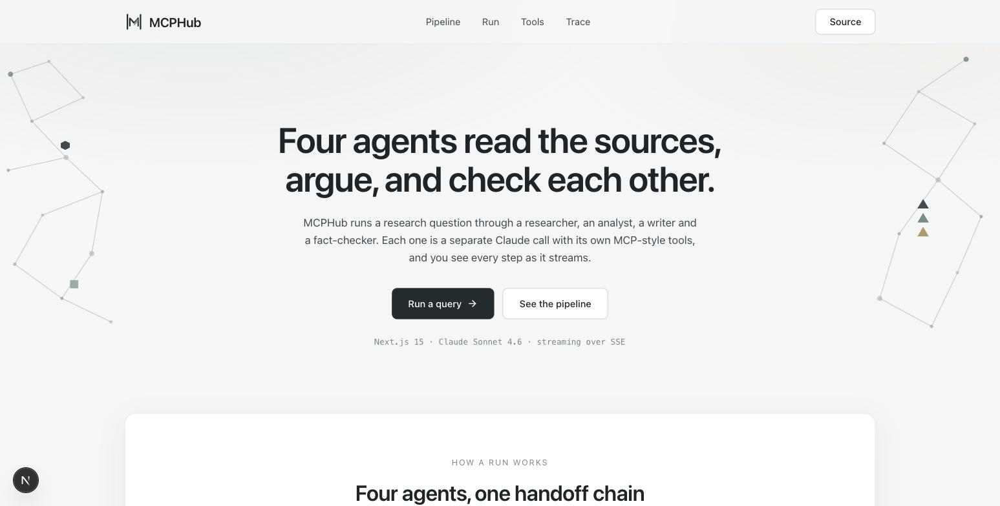

# MCPHub: Multi-Agent Research on the Model Context Protocol

A four-agent research pipeline built on Anthropic's **Model Context Protocol** (MCP). Researcher, Analyst, Writer, Fact-Checker. Each stage is a separate Claude Sonnet 4.6 call with role-specific system prompts and access to custom MCP-style tools. Trace events stream live over Server-Sent Events so you watch the agents work.



## Why This Project

- **MCP is the new standard** for connecting LLMs to data and tools. It is Anthropic's open protocol, adopted by Claude, Cursor, Continue, and the rest of the AI tooling ecosystem.
- Almost no fresher resume has MCP-server work on it yet, so this is the differentiator the AI eng job market in 2026 is paying for.
- Demonstrates **tool-use loops, multi-agent orchestration, streaming traces, and production-grade tool safety**, the actual day-to-day of AI engineering, not just "I called the API."

## What's Built

```
                User question
                     │
                     ▼
         ┌──────────────────────┐    tools: search_kb, fetch_doc
         │     Researcher       │ ──▶ Pull relevant material from
         └──────────┬───────────┘     the in-repo knowledge base
                    ▼
         ┌──────────────────────┐    tools: calculate
         │      Analyst         │ ──▶ Synthesize claims, run any math
         └──────────┬───────────┘
                    ▼
         ┌──────────────────────┐    no tools
         │       Writer         │ ──▶ Markdown answer with citations
         └──────────┬───────────┘
                    ▼
         ┌──────────────────────┐    tools: search_kb, fetch_doc
         │    Fact-Checker      │ ──▶ Per-claim verdict + SHIP/REVISE/BLOCK
         └──────────────────────┘
```

### MCP-style tool registry

Tools live in `tools/` as self-contained modules with a name, zod schema, and pure handler. The orchestrator picks them up dynamically, so adding a new tool is literally one `defineTool(...)` call. The contract (name, JSON-schema input, sandboxed handler) is the same as a real MCP server; in a production deployment each tool would live in its own subprocess and Claude would discover it via Agent Cards.

Current tools:
- **`search_kb`**: lexical search over an in-repo Markdown knowledge base
- **`fetch_doc`**: return the full contents of a doc by path
- **`calculate`**: safe arithmetic evaluator (no Python `eval`, no code injection)

## Tech Stack

| Component | Tool |
|---|---|
| App framework | Next.js 15 App Router (Node runtime API routes) |
| LLM | **Anthropic Claude Sonnet 4.6** via the official `@anthropic-ai/sdk` |
| Tool layer | MCP-style tool registry (no SDK dependency); tools defined via zod schemas |
| Validation | Zod + a minimal zod→JSON-schema bridge for Claude tool definitions |
| Streaming | Server-Sent Events for real-time trace delivery |
| Frontend | React 18 + Tailwind v3 + Framer Motion |
| Design system | `.claude/skills/frontend-design/SKILL.md`, auto-loaded by Claude Code |
| Markdown | `react-markdown` + `remark-gfm` |
| Testing | Vitest |
| CI | GitHub Actions (Node 20 & 22 matrix) |

## Project Structure

```
mcphub/
├── tools/                        # MCP-style tool registry
│   ├── registry.ts               # defineTool / listTools / zod→JSON-schema bridge
│   ├── knowledge-base.ts         # search_kb + fetch_doc over a 7-doc corpus
│   └── compute.ts                # safe arithmetic evaluator
├── server/
│   └── agent.ts                  # Pipeline orchestrator + per-role Claude calls
├── app/
│   ├── page.tsx                  # Landing page: hero, pipeline, run form, trace
│   ├── layout.tsx
│   └── api/
│       ├── run/route.ts          # POST → streams trace events over SSE
│       └── health/route.ts       # GET → tool list + apiKeyConfigured flag
├── components/
│   ├── nav.tsx / footer.tsx / logo.tsx
│   ├── hero.tsx                  # Hero copy + CTAs
│   ├── constellation.tsx         # Decorative node-graph backdrop
│   ├── pipeline.tsx              # Four-stage diagram with per-role tool lists
│   ├── tools-section.tsx         # Tool registry cards
│   ├── run-form.tsx              # Streaming SSE client + suggestion chips
│   └── trace-event.tsx           # Trace log lines + stage output rendering
├── tests/
│   ├── registry.test.ts          # Registry shape + zod-validation regression
│   └── tools.test.ts             # 9 tests covering tool handlers + safety
├── .claude/skills/frontend-design/SKILL.md
├── .github/workflows/ci.yml
└── README.md
```

## Run Locally

```bash
git clone https://github.com/DevNagi31/mcphub.git
cd mcphub
npm install

# 1. Set your Anthropic API key (free $5 credit at console.anthropic.com)
cp .env.example .env.local
# Edit .env.local → ANTHROPIC_API_KEY=sk-ant-...

# 2. Run tests (no API key required; they hit the tool handlers, not Claude)
npx vitest run

# 3. Start the dev server
npm run dev
# → http://localhost:3030
```

Click a suggestion chip or type your own question. The pipeline starts streaming trace events the moment you hit Run. Researcher tool calls appear within a couple seconds, the full four-agent run completes in 15-30 seconds depending on Claude latency.

## The Hard Parts (Interview-Defensible)

1. **MCP-style tool contract.** Every tool is `{ name, description, JSON-schema input, handler }`. The minimal zod→JSON-schema bridge in `tools/registry.ts` keeps the contract typed in TypeScript while emitting exactly what Claude's tools API expects. Adding a new tool is one `defineTool` call and the orchestrator picks it up, the same dynamic-discovery property a real MCP server gets via Agent Cards.

2. **Per-role tool whitelisting.** Every agent only sees the tools its role needs. The Writer has zero tools (forces it to synthesize, not lookup); the Fact-Checker has the same tools as the Researcher (so it can re-verify against source). This is a tiny detail with a big effect on agent behavior.

3. **Streaming traces over SSE.** The run endpoint is an `AsyncGenerator<TraceEvent>` that yields typed events (`start`, `thinking`, `tool_call`, `tool_result`, `finish`, `done`) as Claude responds. The frontend renders them progressively, so you see the researcher's `search_kb` call land before the analyst even starts. Same UX pattern Cursor and Claude Code use for their tool-use loops.

4. **Safe arithmetic.** `calculate` looks trivial but uses a deliberate allow-list regex on the expression *before* `new Function`. Anything other than digits / + - * / ( ) ^ % is rejected. Direct `eval`-class shortcuts (`process.exit`, `require`, identifiers, etc.) all fail at the regex layer. Tested with explicit injection attempts.

5. **Tested like production.** 12 unit tests cover the registry contract, zod-validation rejection of malformed inputs, ranked retrieval correctness, exponent and division-by-zero edge cases for `calculate`, and code-injection-rejection for the safety regex. CI runs the suite on Node 20 and 22 plus a full Next.js production build.

## Roadmap

- [ ] Real Anthropic MCP server transports (stdio + HTTP) so external MCP servers such as Notion, GitHub and Slack plug in unchanged
- [ ] Supervisor-pattern variant where a planning agent routes work dynamically instead of a fixed pipeline
- [ ] LangGraph integration for explicit state-machine orchestration
- [ ] Replay store where every run gets a permalink; the Fact-Checker can compare against historical claims
- [ ] Benchmark dashboard: accuracy vs cost vs latency across Claude Sonnet, Llama 3.3, Qwen 2.5
